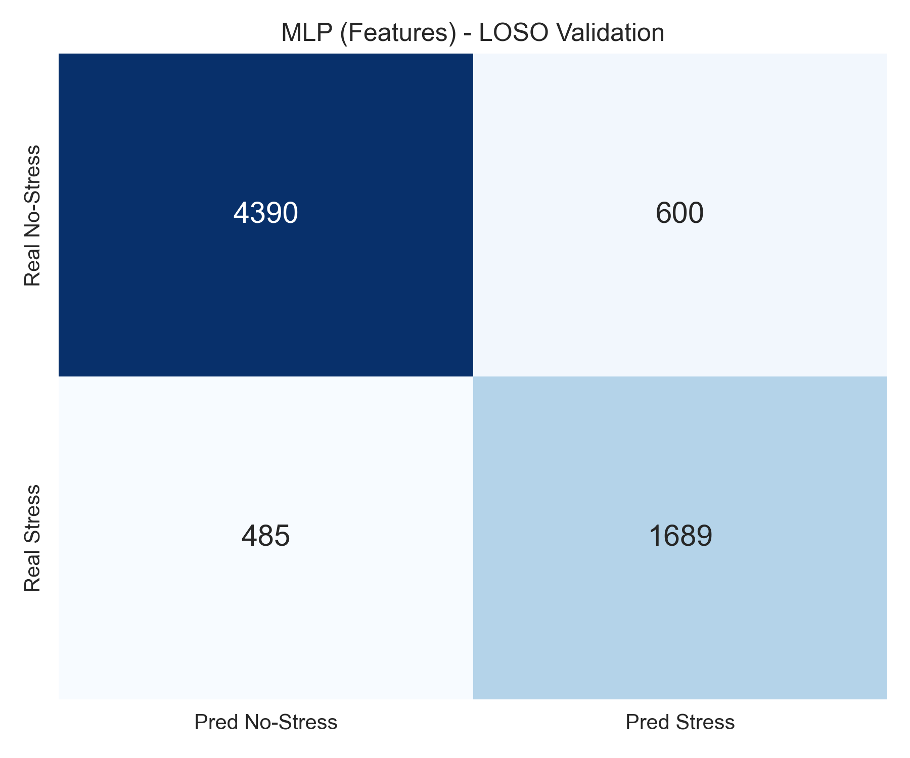
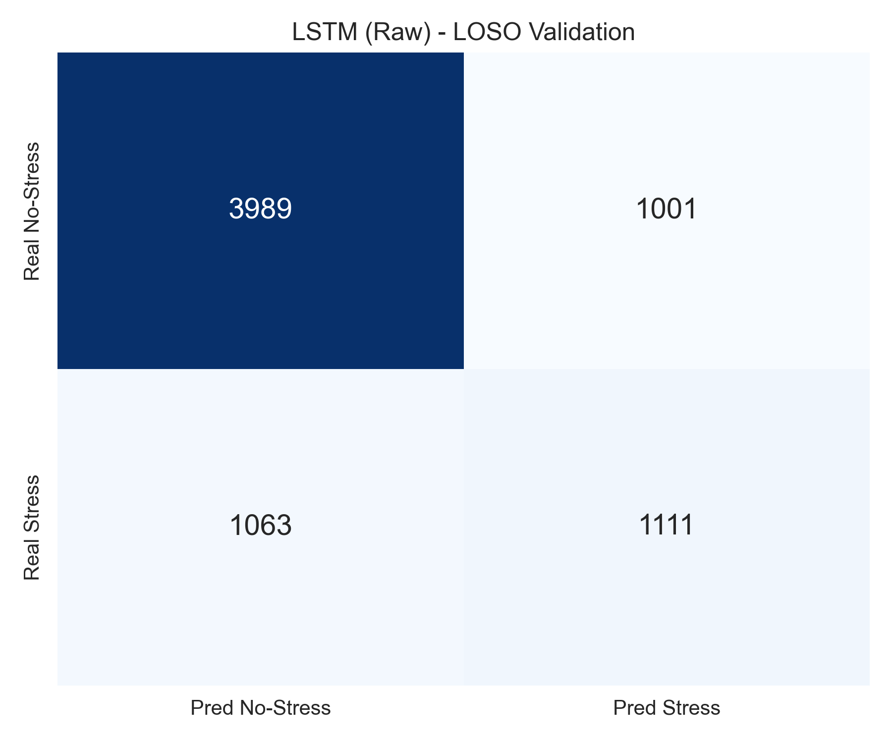

# Projeto de Análise de Sinais Fisiológicos e XAI

Este projeto contém scripts em Python para processamento de dados de sinais fisiológicos (baseado no dataset WESAD ou dados sintéticos para demonstração) e geração de visualizações para análise de estresse e explicabilidade de modelos (XAI).

## Visão Geral
O objetivo principal é gerar figuras para artigos científicos que demonstrem:
1.  **Importância das Características (Feature Importance)**: Visualização dos atributos mais relevantes para o modelo de detecção de estresse (Figura 10).
2.  **Sinais no Domínio do Tempo**: Visualização dos sinais brutos de EDA, Temperatura, Acelerômetro e BVP.
3.  **Explicabilidade Temporal (Saliency Maps)**: Análise detalhada de segmentos do sinal BVP com mapa de calor de atribuição (Figura 11).

## Estrutura do Projeto

### Scripts Python
- `wearablereserach.py`: Script original de referência para processamento do dataset WESAD.
- `visualize_signals.py`: Gera os gráficos dos sinais fisiológicos no domínio do tempo (EDA, TEMP, ACC, BVP). *Nota: Utiliza dados sintéticos caso o dataset WESAD não seja encontrado localmente.*
- `generate_figure_10.py`: Gera a **Figura 10** (Gráfico de barras de Feature Importance).
- `generate_figure_11.py`: Gera a **Figura 11** (Sinal BVP com mapa de calor de saliência temporal).
- `export_metadata.py`: Exporta os dados brutos e configurações de todas as figuras para um arquivo JSON (`figures_metadata.json`).
- `split_metadata.py`: Divide o arquivo de metadados combinado em arquivos individuais por figura.

### Outputs (Resultados)
- **Imagens**: `figure_10.png`, `figure_11.png`, `figure_eda_time.png`, etc.
- **Metadados (JSON)**:
    - `figures_metadata.json`: Todos os dados combinados.
    - `metadata_figure_10.json`: Dados específicos da Figura 10.
    - `metadata_figure_11.json`: Dados específicos da Figura 11.
    - `metadata_time_domain.json`: Dados dos sinais no tempo.

## Como Executar

### 1. Pré-requisitos
Certifique-se de ter o Python 3 instalado. Instale as dependências necessárias:

```bash
pip install matplotlib seaborn numpy pandas
```

### 2. Gerar Figuras
Para gerar todas as visualizações:

```bash
# Gerar Feature Importance (Fig 10)
python3 generate_figure_10.py

# Gerar Sinais no Tempo (EDA, TEMP, ACC, BVP)
python3 visualize_signals.py

# Gerar Saliência Temporal BVP (Fig 11)
python3 generate_figure_11.py
```

### 3. Exportar Metadados
Para gerar os arquivos JSON com os pontos de dados para reprodução externa:

```bash
# Exportar tudo para um JSON
python3 export_metadata.py

# Dividir em arquivos separados
python3 split_metadata.py
```

### 4. Treinamento de Modelos (LSTM vs MLP)
O projeto inclui scripts para treinar e validar modelos de detecção de estresse, com tratamento para desbalanceamento de classes.

```bash
# Executar treinamento (padrão: modo demo rápido)
python3 train_models.py
```
*Para executar a validação completa (LOSO em todos os sujeitos), edite `train_models.py` e defina `DEMO_MODE = False`.*


## Resultados Obtidos (Demo / Sintético)
Abaixo estão os resultados consolidados da execução com dados sintéticos (modo demonstração), comparando a validação **LOSO** (Leave-One-Subject-Out) com a divisão padrão (**Standard Split**).

### Comparativo de Métricas
| Modelo (Validação) | Acurácia | AUC | F1-Score (Stress) | F1-Score (No-Stress) |
| :--- | :---: | :---: | :---: | :---: |
| **LOSO MLP** | 88.76% | 0.9572 | **0.8187** | 0.9186 |
| **LOSO LSTM** | 88.95% | 0.9554 | 0.8193 | 0.9204 |
| **Standard MLP** | 87.63% | 0.9459 | 0.8067 | 0.9091 |
| **Standard LSTM** | 90.36% | 0.9649 | 0.8511 | 0.9287 |

> **Nota**: O uso de *Class Weights* foi eficaz, elevando o F1-Score da classe Stress (anteriormente ~0.56) para acima de 0.80 em todos os cenários.

### Matrizes de Confusão

#### MLP (Features) - Validação LOSO
| | Pred: No-Stress | Pred: Stress |
| :--- | :---: | :---: |
| **Real: No-Stress** | 987 (TN) | 127 (FP) |
| **Real: Stress** | 48 (FN) | **395 (TP)** |

#### LSTM (Raw) - Validação LOSO
| | Pred: No-Stress | Pred: Stress |
| :--- | :---: | :---: |
| **Real: No-Stress** | 995 (TN) | 119 (FP) |
| **Real: Stress** | 53 (FN) | **390 (TP)** |

#### MLP (Features) - Validação LOSO


#### LSTM (Raw) - Validação LOSO


_Legenda: TN=Verdadeiro Negativo, FP=Falso Positivo, FN=Falso Negativo, TP=Verdadeiro Positivo_

## Notas
- Caso o arquivo de dados original (`.pkl` do WESAD) não esteja presente na pasta, o script `visualize_signals.py` gerará dados sintéticos realistas para fins de demonstração e calibração dos gráficos.
- As Figuras 10 e 11 utilizam parâmetros fixos ou gerados proceduralmente para garantir que correspondam estritamente às descrições científicas fornecidas.
